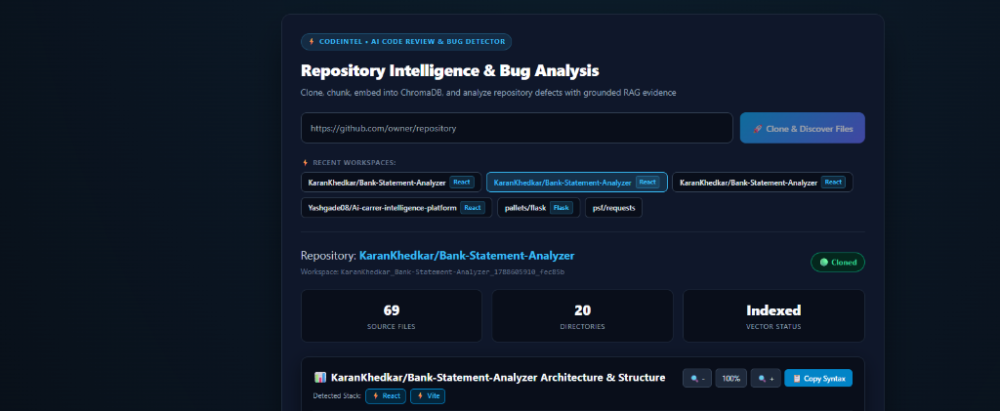
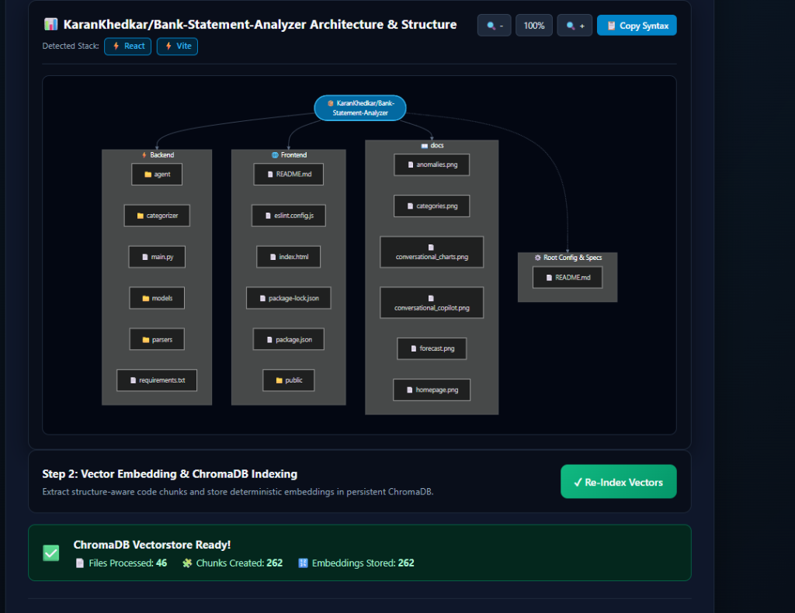
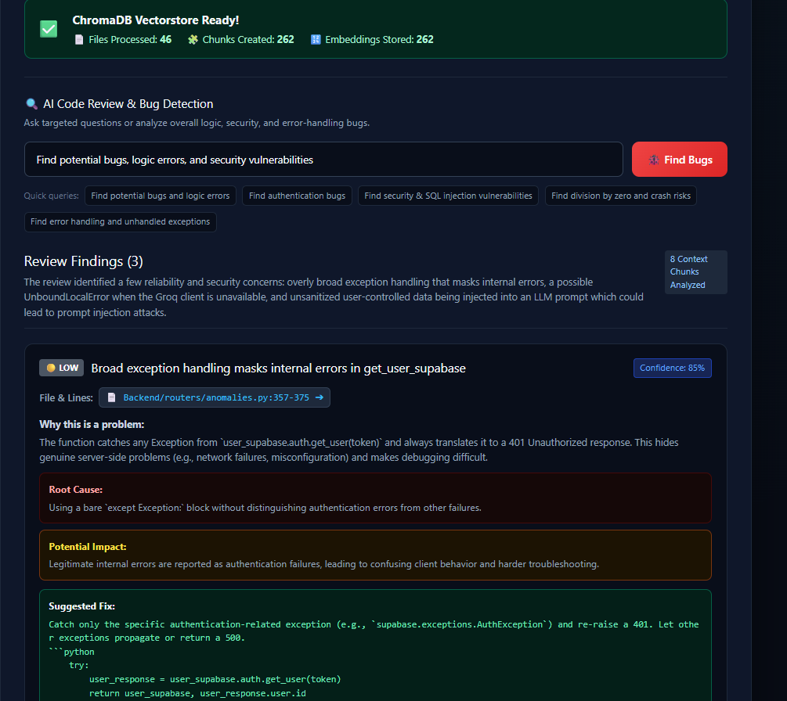
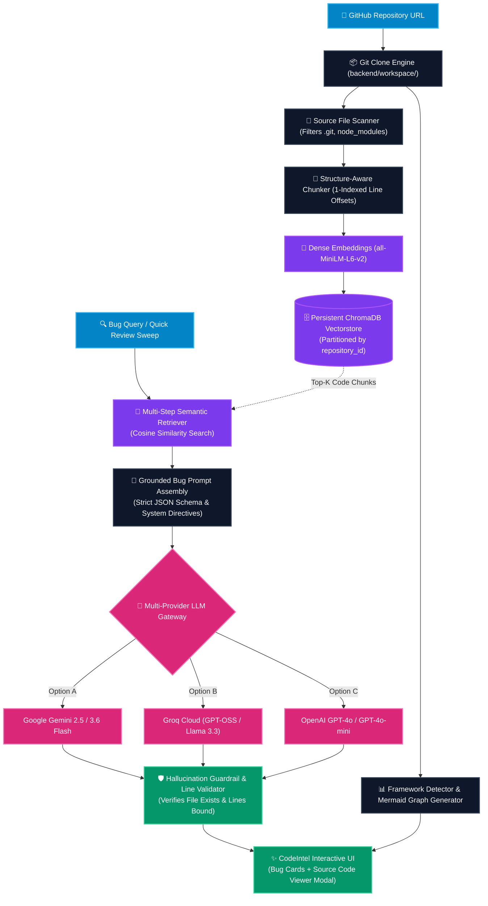
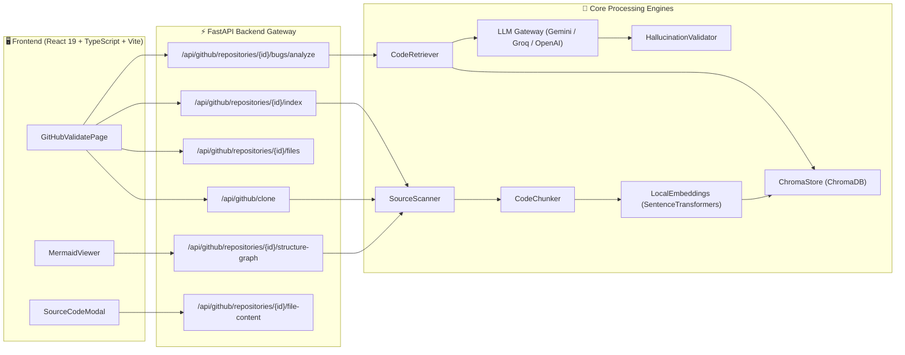
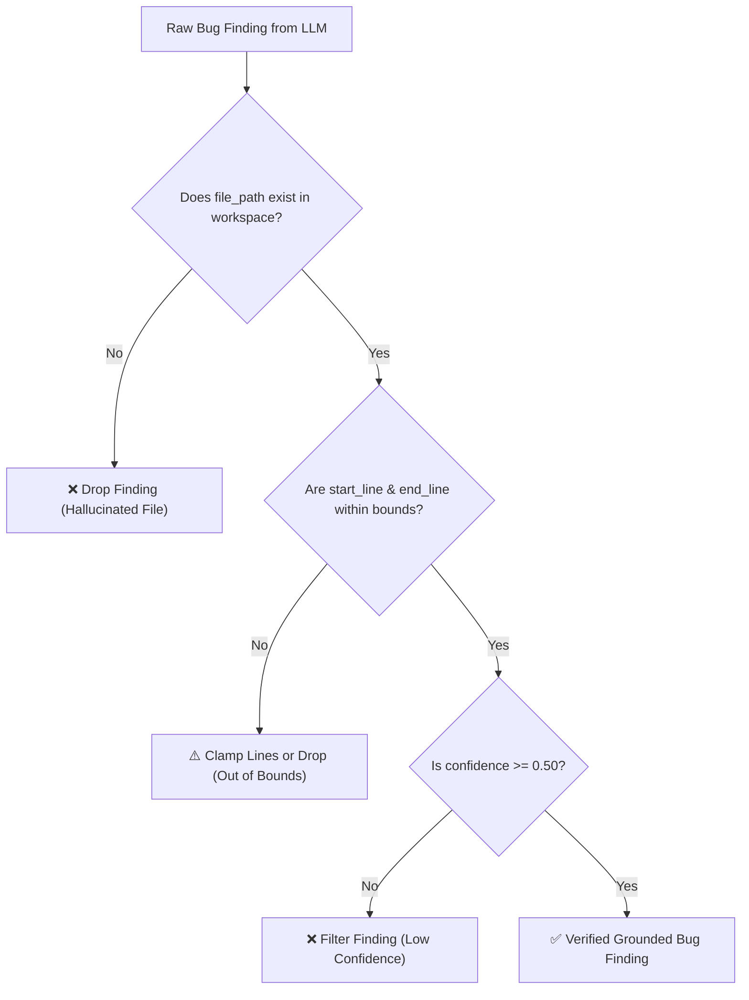

# ⚡ CodeIntel: Repository Intelligence & AI Bug Detection Engine

[](https://www.python.org/downloads/)
[](https://fastapi.tiangolo.com)
[](https://react.dev)
[](https://www.typescriptlang.org/)
[](https://www.trychroma.com/)
[](https://huggingface.co/sentence-transformers/all-MiniLM-L6-v2)
[](https://mermaid.js.org/)
[](https://opensource.org/licenses/MIT)

**CodeIntel** is an autonomous, production-grade GitHub repository intelligence engine that clones, parses, visualizes, indexes, and conducts grounded AI code reviews on entire software projects.

Combining **local Git isolation**, **AST-aware code chunking**, **Sentence-Transformers dense embeddings**, **persistent ChromaDB vector storage**, **interactive Mermaid.js architecture diagrams**, and **multi-provider LLM RAG pipelines**, CodeIntel discovers architectural defects, security vulnerabilities, and logic flaws with verified source code evidence.

---

## 📸 Visual Showcase & Platform Tour

### 1. Repository Intelligence & Workspace Management
Enter any public GitHub repository URL. CodeIntel clones the repository into an isolated workspace, analyzes the folder hierarchy, categorizes files by language, and presents quick-switch access to recently cloned projects.



* **Isolated Workspace Provisioning**: Clones directly into sandboxed directories without polluting the host environment.
* **Instant Project Statistics**: Total source files, directory counts, language distribution, and vector indexing status.
* **Recent Workspaces Bar**: Single-click access to previously cloned repositories (`fastapi/fastapi`, `psf/requests`, `pallets/flask`, etc.) with detected framework tags.

---

### 2. Interactive Mermaid.js Architecture & ChromaDB Vector Indexing
CodeIntel detects the project’s underlying tech stack (FastAPI, React, Flask, Vite, Django, Go, etc.) and constructs an interactive, dark-themed topological flowchart of all modules, entrypoints, and configurations.



* **Topological Project Graph**: Categorizes modules by responsibility (`⚡ Backend`, `🌐 Frontend`, `🧪 Tests`, `📖 Documentation`, `⚙️ Config & Specs`).
* **Interactive Diagram Controls**: Zoom In (`+15%`), Zoom Out (`-15%`), Reset Zoom (`100%`), and One-Click **📋 Copy Syntax** for documentation.
* **High-Throughput Vector Indexing**: Chunks source files with exact line bounds and stores dense vector embeddings in persistent ChromaDB.

---

### 3. Grounded AI Bug Detection & Evidence-Backed Review Findings
Ask targeted questions (e.g., authentication flaws, crash risks, unhandled exceptions) or run comprehensive security sweeps. CodeIntel retrieves isolated semantic code context and coordinates with state-of-the-art LLMs (Gemini, Groq, OpenAI) to identify genuine defects.



* **Severity & Confidence Scoring**: Bugs are triaged by severity (`🔴 HIGH`, `🟠 MEDIUM`, `🟡 LOW`) with statistical confidence percentages.
* **Grounded File & Line Evidence**: Direct link to the culprit file and line range (`📄 Backend/routers/anomalies.py:357-375`).
* **Root Cause & Impact Analysis**: Explains why the code fails, the real-world operational consequence, and provides a ready-to-merge code fix snippet.
* **Interactive Source Modal**: Clicking the evidence tag opens an in-browser code viewer with highlighted culprit lines.

---

## 🏗️ End-to-End System Architecture



---

## ⚙️ Core Technical Deep Dive



### 1. Isolated Git Cloning & Workspace Security
* **Path Traversal Defense**: All repository identifiers and target paths are validated against malicious directory traversal (`..` sequences, absolute Windows/POSIX path injections).
* **Deterministic Isolation**: Clones are partitioned inside `backend/workspace/{owner}_{repo}_{timestamp}_{hash}/`.
* **Zero Host Contamination**: Repositories are cloned using native Git subprocesses without mutating local packages or executing arbitrary install scripts.

### 2. Recursive File Discovery & Language Parsing
* **Exclusion Filters**: Automatically prunes noisy, auto-generated, or heavy dependencies:
  `.git`, `node_modules`, `__pycache__`, `.venv`, `dist`, `build`, `coverage`, `.pytest_cache`, `.mypy_cache`, `.next`, `target`, `bin`, `.idea`, `.vscode`.
* **Language Classification**: Maps file extensions (`.py`, `.ts`, `.tsx`, `.js`, `.jsx`, `.java`, `.go`, `.rs`, `.c`, `.cpp`, `.sql`, etc.) into categorized metrics.
* **Safety Bounds**: Skips binary blobs, minified bundles, and files larger than 1MB to optimize memory overhead.

### 3. Topological Mermaid.js Architecture Visualizer
* **Framework Fingerprinting**: Inspects root and subfolder manifests (`package.json`, `pyproject.toml`, `requirements.txt`, `go.mod`, `Cargo.toml`, `pom.xml`):
  * **Python**: FastAPI, Flask, Django
  * **JavaScript/TypeScript**: React, Next.js, Vite, Vue
  * **Systems**: Go, Rust, Java
* **Graph Synthesis**: Emits dark-mode Mermaid `flowchart TD` code organizing directories into interconnected subsystems:
  * `ROOT(["📦 owner/repo"])`
  * Subgraphs for `⚡ Backend`, `🌐 Frontend`, `🧪 Tests`, `📖 Documentation`
  * Connects essential specifications: `⚙️ Root Config & Specs` (`README.md`, `docker-compose.yml`, `package.json`, `pyproject.toml`)

### 4. Structure-Aware Code Chunking
Standard text chunkers break syntax mid-function. CodeIntel utilizes structure-aware chunking:
* **Line-Accurate Tracking**: Captures exact 1-indexed `start_line` and `end_line` offsets.
* **Deterministic Chunk Identifiers**: Computes SHA256 hashes based on `(repository_id, file_path, start_line, end_line, content)` to ensure idempotency on re-indexing.
* **Chunk Overlap Preservation**: Maintains 20-line boundary context to retain symbol definitions and scope.

### 5. Multi-Tenant Vectorstore & Isolated Semantic Retrieval
* **Local Dense Embeddings**: Embeds chunks using `sentence-transformers/all-MiniLM-L6-v2`, producing normalized 384-dimensional dense vectors on CPU/GPU without external API latency or costs.
* **Partitioned ChromaDB**: Backed by persistent SQLite storage in `backend/storage/codeintel.db` and Chroma collections.
* **Cross-Repo Isolation**: Every vector query enforces mandatory metadata filtering:
  ```python
  collection.query(
      query_embeddings=[query_vector],
      n_results=top_k,
      where={"repository_id": clean_repository_id}
  )
  ```
  This guarantees code chunks from one repository can **never** bleed into another repository's analysis.

### 6. Multi-Provider LLM Gateway & Structured JSON Directives
* **Supported Providers**:
  * **Google Gemini**: `gemini-2.5-flash` / `gemini-3.6-flash`
  * **Groq Cloud**: High-speed inference (`openai/gpt-oss-120b`, `llama-3.3-70b-versatile`)
  * **OpenAI**: `gpt-4o`, `gpt-4o-mini`
* **Structured JSON Enforcement**: LLMs are instructed with strict system schemas:
  ```json
  {
    "summary": "High-level summary of review findings",
    "total_findings": 1,
    "findings": [
      {
        "title": "Concise defect title",
        "severity": "HIGH | MEDIUM | LOW",
        "confidence": 0.85,
        "file_path": "relative/path/to/file.py",
        "start_line": 357,
        "end_line": 375,
        "description": "Why this is a problem",
        "root_cause": "Underlying mechanism causing the bug",
        "impact": "Operational consequence if unpatched",
        "suggested_fix": "python\ncode snippet\n"
      }
    ]
  }
  ```

### 7. Hallucination Control & Grounding Guardrails



* **Filesystem Grounding**: Every reported `file_path` is checked against the actual cloned disk. If the LLM invents a non-existent file, it is immediately pruned.
* **Line Range Guard**: Validates that $1 \le \text{start\_line} \le \text{end\_line} \le \text{total\_lines(file)}$.
* **Confidence Gating**: Filters out speculative or ungrounded claims with confidence scores below 50%.

---

## 📁 Repository Directory Structure

```text
Codeintel/
├── backend/
│   ├── app/
│   │   ├── api/                     # REST API route handlers
│   │   │   ├── github_clone.py      # POST /clone: URL validation & Git cloning
│   │   │   ├── github_files.py      # GET /files: Recursive file & language scanner
│   │   │   ├── github_graph.py      # GET /structure-graph, GET /workspaces
│   │   │   ├── github_index.py      # POST /index: Vector embedding & ChromaDB storage
│   │   │   ├── github_bugs.py       # POST /bugs/analyze: Semantic RAG bug detection
│   │   │   ├── github_source.py     # GET /file-content: Code modal line viewer
│   │   │   └── github_validate.py   # Legacy validation route
│   │   ├── bug_detection/           # RAG orchestrator & anti-hallucination engine
│   │   │   ├── engine.py            # End-to-end RAG review coordinator
│   │   │   ├── prompts.py           # Grounded review prompts & system instructions
│   │   │   └── validator.py         # Grounding & line-boundary verification
│   │   ├── chunking/                # Structure-aware code splitter
│   │   │   └── code_chunker.py      # Line-bound chunker with SHA256 deduplication
│   │   ├── core/                    # Core application settings
│   │   │   └── config.py            # Pydantic BaseSettings & env resolution
│   │   ├── embeddings/              # Dense vector embedding providers
│   │   │   ├── base.py              # Abstract embedding interface
│   │   │   └── local_embeddings.py  # Local SentenceTransformers (all-MiniLM-L6-v2)
│   │   ├── llm/                     # Multi-provider LLM clients
│   │   │   ├── base.py              # Base LLM provider contract
│   │   │   ├── gemini_provider.py   # Google Gemini API client
│   │   │   └── openai_provider.py   # OpenAI / Groq Cloud compatible client
│   │   ├── retrieval/               # Isolated semantic retrieval
│   │   │   └── code_retriever.py    # Vector similarity search with repo isolation
│   │   ├── scanner/                 # Code discovery and filtering
│   │   │   └── source_scanner.py    # Supported file discovery & content reader
│   │   ├── vectorstore/             # ChromaDB client & collection management
│   │   │   └── chroma_store.py      # Persistent vector database interface
│   │   └── main.py                  # FastAPI application entrypoint & CORS setup
│   ├── data/                        # Persistent ChromaDB vector collections
│   ├── storage/                     # SQLite databases and session caches
│   ├── tests/                       # Automated pytest test suites
│   │   ├── fixtures/buggy_repo/     # Deliberately buggy repository test fixture
│   │   ├── test_ai_bug_detection.py # Full RAG & Hallucination test suite
│   │   └── test_step3_files.py      # File scanning regression tests
│   ├── workspace/                   # Isolated local Git clones
│   ├── pyproject.toml               # Python project configuration & dependencies
│   └── .env                         # Environment variables and API keys
│
├── frontend/
│   ├── src/
│   │   ├── components/              # UI components
│   │   │   └── MermaidViewer.tsx    # Interactive Mermaid diagram canvas with controls
│   │   ├── pages/                   # Application views
│   │   │   └── GitHubValidatePage.tsx# Main dashboard (Clone, Graph, Index, Review)
│   │   ├── App.tsx                  # Root application router
│   │   └── main.tsx                 # React DOM entrypoint
│   ├── package.json                 # Frontend dependencies (React 19, Mermaid, Vite)
│   └── vite.config.ts               # Vite configuration with backend proxy
│
├── docs/
│   └── images/                      # High-resolution screenshots for documentation
│       ├── 01-repo-intelligence-dashboard.png
│       ├── 02-mermaid-architecture-and-indexing.png
│       └── 03-ai-code-review-and-bug-finding.png
└── README.md                        # Master project documentation
```

---

## 📡 REST API Reference

| Method | Endpoint | Description | Key Payload / Parameters |
| :--- | :--- | :--- | :--- |
| `POST` | `/api/github/clone` | Validates URL, clones repo to local workspace, returns file count | `{"url": "https://github.com/owner/repo"}` |
| `GET` | `/api/github/workspaces` | Lists all existing cloned workspaces with detected tech stacks | *None* |
| `GET` | `/api/github/repositories/{id}/files` | Scans workspace directory and returns complete file hierarchy | *Path param: `id`* |
| `GET` | `/api/github/repositories/{id}/structure-graph` | Generates Mermaid flowchart syntax and detected frameworks | *Path param: `id`* |
| `POST` | `/api/github/repositories/{id}/index` | Chunks source files, generates embeddings, stores in ChromaDB | *Path param: `id`* |
| `POST` | `/api/github/repositories/{id}/bugs/analyze` | Executes semantic RAG retrieval and LLM bug analysis | `{"query": "Find logic and security bugs"}` |
| `GET` | `/api/github/repositories/{id}/file-content` | Retrieves source code lines with context for modal display | `?path=app.py&start_line=10&end_line=25` |

---

## 🚀 Quickstart & Setup Guide

### ⚡ Quick Run Commands

If dependencies are already installed, run the services using either the one-click scripts or two separate terminals:

#### Option A: One-Click Launchers (Windows)
* **Double-click `start.bat`** or run in terminal:
  ```cmd
  .\start.bat
  ```
* **Or run in PowerShell**:
  ```powershell
  .\start.ps1
  ```

#### Option B: Separate Terminals

**Terminal 1 — Backend (FastAPI)**
```bash
cd backend

# Windows (PowerShell)
.\.venv\Scripts\Activate.ps1
uvicorn app.main:app --reload --host 127.0.0.1 --port 8000

# Windows (Command Prompt)
.\.venv\Scripts\activate.bat
uvicorn app.main:app --reload --host 127.0.0.1 --port 8000

# macOS / Linux
source .venv/bin/activate
uvicorn app.main:app --reload --host 127.0.0.1 --port 8000
```
> **Backend URL**: `http://127.0.0.1:8000`  
> **API Documentation (Swagger UI)**: `http://127.0.0.1:8000/docs`

**Terminal 2 — Frontend (Vite + React)**
```bash
cd frontend
npm run dev
```
> **Frontend URL**: `http://localhost:5173`

---

### Prerequisites
* **Git**: Installed and available on system `PATH`
* **Python**: `3.10` or higher (Python `3.11` recommended)
* **Node.js**: `18.0.0` or higher with `npm`

---

### Step 1: Clone the CodeIntel Repository
```bash
git clone https://github.com/your-username/Codeintel.git
cd Codeintel
```

---

### Step 2: Backend Setup
```bash
cd backend

# Create and activate a virtual environment
python -m venv .venv

# On Windows (PowerShell):
.\.venv\Scripts\Activate.ps1

# On Linux / macOS:
source .venv/bin/activate

# Install dependencies
pip install -e ".[all]"
```

#### Configure Environment Variables (`backend/.env`)
Create a `.env` file inside the `backend/` directory:

```env
# ==============================================================================
# LLM Provider Configuration
# Supported providers: gemini | groq | openai
# ==============================================================================
LLM_PROVIDER=gemini

# Option A: Google Gemini (Free API Key: https://aistudio.google.com/app/apikey)
GEMINI_API_KEY=your_gemini_api_key_here
GEMINI_MODEL=gemini-2.5-flash

# Option B: Groq Cloud (Free API Key: https://console.groq.com/keys)
GROQ_API_KEY=your_groq_api_key_here
GROQ_MODEL=openai/gpt-oss-120b

# Option C: OpenAI (https://platform.openai.com/)
OPENAI_API_KEY=your_openai_api_key_here
OPENAI_MODEL=gpt-4o-mini

# ==============================================================================
# Vector Database & Embedding Settings
# ==============================================================================
EMBEDDING_MODEL=all-MiniLM-L6-v2
CHROMA_PERSIST_DIRECTORY=./data/chroma
```

#### Launch Backend Server

Run the backend server using Uvicorn:

* **Windows (PowerShell)**:
  ```powershell
  .\.venv\Scripts\Activate.ps1
  uvicorn app.main:app --reload --host 127.0.0.1 --port 8000
  ```
  *(Or directly without activating venv: `.\.venv\Scripts\python.exe -m uvicorn app.main:app --reload --host 127.0.0.1 --port 8000`)*

* **Windows (Command Prompt / CMD)**:
  ```cmd
  .\.venv\Scripts\activate.bat
  uvicorn app.main:app --reload --host 127.0.0.1 --port 8000
  ```

* **macOS / Linux**:
  ```bash
  source .venv/bin/activate
  uvicorn app.main:app --reload --host 127.0.0.1 --port 8000
  ```

* **Backend API URL**: `http://127.0.0.1:8000`
* **Interactive API Documentation (Swagger)**: `http://127.0.0.1:8000/docs`

---

### Step 3: Frontend Setup
Open a **second terminal window**:

```bash
cd frontend

# Install dependencies (React 19, Mermaid, Vite, Tailwind)
npm install

# Start Vite development server
npm run dev
```

* **Frontend Dashboard URL**: `http://localhost:5173`

---

## 🧪 Verification & Automated Testing

CodeIntel includes automated unit and integration tests covering source scanning, chunking, vector isolation, and RAG bug detection:

```bash
cd backend

# Run the complete test suite
pytest -v

# Run AI bug detection & RAG retrieval tests specifically
pytest tests/test_ai_bug_detection.py -v

# Run Step 3 file scanner regression tests
pytest tests/test_step3_files.py -v
```

### Frontend Type Safety & Production Build
```bash
cd frontend

# Verify TypeScript types
npx tsc --noEmit

# Build production bundle
npm run build
```

---

## 🛡️ Security & Privacy Guarantees
* **Air-Gapped Embedding Computation**: Code chunk embeddings are computed locally via SentenceTransformers on your local CPU/GPU. No source code chunks are transmitted to third-party embedding APIs.
* **Tenant Workspace Isolation**: Vector queries strictly mandate `repository_id` filters, preventing cross-project code contamination.
* **Controlled LLM Transmission**: Only the most relevant retrieved context chunks (`Top-K`) matching the user's specific bug query are transmitted to the configured LLM for grounded review.

---

## 📄 License
This project is licensed under the **MIT License**. See the [LICENSE](LICENSE) file for details.
