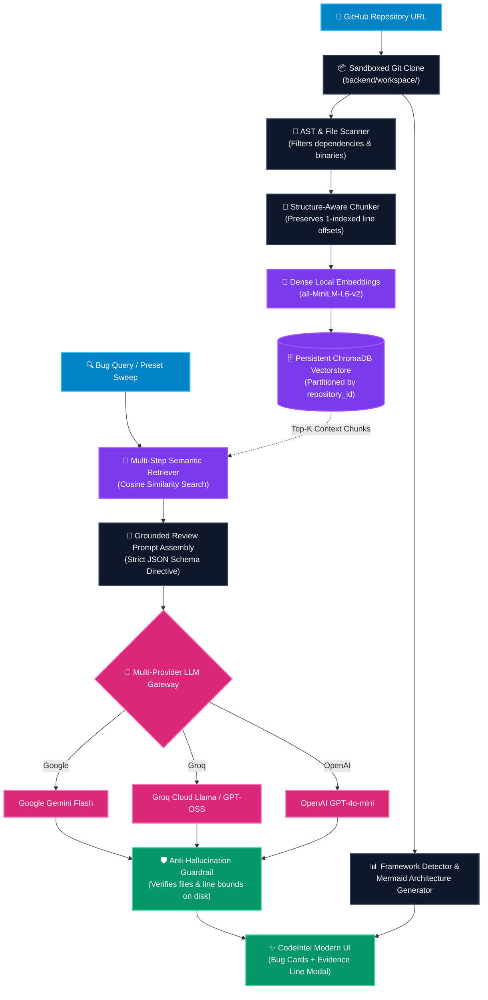

# ⚡ CodeIntel — Autonomous AI Code Review & Repository Intelligence Engine

[](https://www.python.org/downloads/)
[](https://fastapi.tiangolo.com)
[](https://react.dev)
[](https://www.typescriptlang.org/)
[](https://vitejs.dev)
[](https://www.trychroma.com/)
[](https://huggingface.co/sentence-transformers/all-MiniLM-L6-v2)
[](https://mermaid.js.org/)
[](https://opensource.org/licenses/MIT)

**CodeIntel** is an end-to-end, production-grade GitHub repository intelligence platform. It clones any public GitHub repository, visualizes its software architecture with interactive Mermaid diagrams, indexes code chunks into a persistent vector database, and uses multi-provider LLMs (Google Gemini, Groq, OpenAI) to perform grounded, evidence-backed code reviews and defect detection.

---

## 📑 Table of Contents

- [⚡ At a Glance (30-Second Overview)](#-at-a-glance-30-second-overview)
- [✨ Key Features](#-key-features)
- [🚀 60-Second Quick Start (Beginner Friendly)](#-60-second-quick-start-beginner-friendly)
- [📋 Complete Step-by-Step Installation](#-complete-step-by-step-installation)
  - [Prerequisites](#prerequisites)
  - [1. Clone Repository](#1-clone-repository)
  - [2. Backend Setup (FastAPI & Vectorstore)](#2-backend-setup-fastapi--vectorstore)
  - [3. Frontend Setup (React & Vite)](#3-frontend-setup-react--vite)
- [🔑 Environment Configuration (`.env`)](#-environment-configuration-env)
- [🖥️ How to Use CodeIntel (User Guide)](#️-how-to-use-codeintel-user-guide)
- [❓ Troubleshooting & Common Issues](#-troubleshooting--common-issues)
- [🏗️ System Architecture & RAG Pipeline](#️-system-architecture--rag-pipeline)
- [📡 REST API Reference](#-rest-api-reference)
- [🧪 Testing & Quality Assurance](#-testing--quality-assurance)
- [🛡️ Privacy & Security Guarantees](#️-privacy--security-guarantees)
- [📄 License](#-license)

---

## ⚡ At a Glance (30-Second Overview)

```
       1. Enter GitHub URL ➔ 2. Cloned & Discovered ➔ 3. Visual Architecture ➔ 4. AI Bug Review
  [ https://github.com/... ] ➔ [ Isolated Workspace ] ➔ [ Mermaid Flowchart ] ➔ [ Grounded Bugs & Fixes ]
```

1. **Clone Any Repository**: Enter a GitHub repository URL to clone it locally into an isolated workspace directory (`backend/workspace/`).
2. **Inspect Architecture**: Automatically detects tech stacks (FastAPI, React, Django, Express, Go, etc.) and visualizes project hierarchy in interactive Mermaid diagrams.
3. **Embed & Index**: Splits files into structure-aware code chunks and stores 384-dimensional dense vectors in persistent **ChromaDB**.
4. **Detect Defects with AI**: Ask custom queries or trigger security sweeps. LLMs analyze retrieved semantic chunks and highlight genuine defects with exact file & line evidence.
5. **In-Browser IDE Viewer**: Click any finding to inspect source code lines and AST class/method graphs directly in your browser.

---

## ✨ Key Features

| Feature | Description |
| :--- | :--- |
| **🔒 Sandboxed Git Isolation** | Clones repositories into isolated directories without altering host packages or executing untrusted code. |
| **📊 Interactive Mermaid Diagrams** | Zoom, pan, and copy syntax for topological project architecture and AST class/function call graphs. |
| **🧠 Local Dense Embeddings** | Computes vector embeddings locally on CPU/GPU via `SentenceTransformers (all-MiniLM-L6-v2)` — zero API costs or code leakage. |
| **🗄️ Multi-Tenant Vectorstore** | Partitioned ChromaDB collections enforce strict `repository_id` filtering, preventing cross-project code contamination. |
| **🤖 Multi-Provider LLM Gateway** | Supports **Google Gemini** (Gemini 2.5/3.6 Flash), **Groq Cloud** (Llama 3.3, GPT-OSS), and **OpenAI** (GPT-4o, GPT-4o-mini). |
| **🛡️ Anti-Hallucination Guardrails** | Strict validation verifies that flagged files and line bounds physically exist in the repository before displaying findings. |
| **💻 High-Contrast Developer UI** | Modern dark-mode interface built with **Plus Jakarta Sans**, **JetBrains Mono**, real-time backend status, and glassmorphic aesthetics. |

---

## 🚀 60-Second Quick Start (Beginner Friendly)

If you have already installed Python and Node.js dependencies, you can launch CodeIntel with a single command:

### On Windows

* **Option 1 (One-Click Batch Script)**:  
  Double-click `start.bat` in the repository root, or run:
  ```cmd
  .\start.bat
  ```

* **Option 2 (One-Click PowerShell Script)**:  
  Right-click `start.ps1` and select **Run with PowerShell**, or run:
  ```powershell
  .\start.ps1
  ```

### On macOS / Linux

Open two terminal tabs:

```bash
# Terminal 1: Backend
cd backend && source .venv/bin/activate && uvicorn app.main:app --reload --port 8000

# Terminal 2: Frontend
cd frontend && npm run dev
```

Open your browser to:
* **Frontend Application**: [http://localhost:5173](http://localhost:5173)
* **Backend API Docs (Swagger UI)**: [http://127.0.0.1:8000/docs](http://127.0.0.1:8000/docs)

---

## 📋 Complete Step-by-Step Installation

### Prerequisites

Ensure you have the following installed on your machine:
* **Git**: Installed and available in terminal (`git --version`)
* **Python**: Version `3.10` or higher (`python --version` or `py --version`)
* **Node.js**: Version `18.0.0` or higher (`node -v` and `npm -v`)

---

### 1. Clone Repository

```bash
git clone https://github.com/Yashgade08/CodeIntel.git
cd CodeIntel
```

---

### 2. Backend Setup (FastAPI & Vectorstore)

Navigate to the `backend` folder:

```bash
cd backend
```

#### Step 2.1: Create & Activate Virtual Environment

* **On Windows (PowerShell)**:
  ```powershell
  python -m venv .venv
  .\.venv\Scripts\Activate.ps1
  ```
  *(If PowerShell shows a script execution error, run: `Set-ExecutionPolicy -Scope Process -ExecutionPolicy Bypass`)*

* **On Windows (Command Prompt / CMD)**:
  ```cmd
  python -m venv .venv
  .\.venv\Scripts\activate.bat
  ```

* **On macOS / Linux**:
  ```bash
  python3 -m venv .venv
  source .venv/bin/activate
  ```

#### Step 2.2: Install Backend Dependencies

```bash
pip install --upgrade pip
pip install -e ".[all]"
```

#### Step 2.3: Configure `.env` File

Copy the example configuration file:

* **Windows**: `copy .env.example .env`
* **macOS / Linux**: `cp .env.example .env`

Open `backend/.env` in your text editor and add at least one free LLM API key:

```env
# Choose provider: gemini | groq | openai
LLM_PROVIDER=gemini

# Google Gemini (Recommended - Free API key from https://aistudio.google.com/app/apikey)
GEMINI_API_KEY=your_gemini_api_key_here
GEMINI_MODEL=gemini-2.5-flash

# Embeddings (Local SentenceTransformers - runs offline on CPU)
EMBEDDING_MODEL=all-MiniLM-L6-v2
CHROMA_PERSIST_DIRECTORY=./data/chroma
```

#### Step 2.4: Start Backend Server

```bash
# Run uvicorn server on port 8000
uvicorn app.main:app --reload --host 127.0.0.1 --port 8000
```

> **Verification**: Visit [http://127.0.0.1:8000/api/health](http://127.0.0.1:8000/api/health) in your browser. You should see:
> `{"status":"ok","service":"codeintel-backend"}`

---

### 3. Frontend Setup (React & Vite)

Open a **new terminal window** and navigate to `frontend`:

```bash
cd frontend
```

#### Step 3.1: Install Node Dependencies

```bash
npm install
```

#### Step 3.2: Launch Vite Dev Server

```bash
npm run dev
```

> **Verification**: Open [http://localhost:5173](http://localhost:5173) in your browser. You will see the CodeIntel dashboard with a green `🟢 FastAPI Online (8000)` indicator in the top navigation bar!

---

## 🔑 Environment Configuration (`.env`)

CodeIntel supports three major LLM providers. You only need an API key for **one** provider to get started:

| Provider | Model | Where to get Free API Key | Configuration in `backend/.env` |
| :--- | :--- | :--- | :--- |
| **Google Gemini** *(Recommended)* | `gemini-2.5-flash` / `gemini-3.6-flash` | [Google AI Studio](https://aistudio.google.com/app/apikey) (Free) | `LLM_PROVIDER=gemini`<br>`GEMINI_API_KEY=AIzaSy...` |
| **Groq Cloud** *(Ultra-fast)* | `openai/gpt-oss-120b` / `llama-3.3-70b-versatile` | [Groq Console](https://console.groq.com/keys) (Free) | `LLM_PROVIDER=groq`<br>`GROQ_API_KEY=gsk_...` |
| **OpenAI** | `gpt-4o-mini` / `gpt-4o` | [OpenAI Platform](https://platform.openai.com/api-keys) | `LLM_PROVIDER=openai`<br>`OPENAI_API_KEY=sk-...` |

### Full `.env` Reference

```env
# Application Settings
APP_NAME=CodeIntel
APP_VERSION=0.1.0
DEBUG=false
HOST=127.0.0.1
PORT=8000

# LLM Gateway Settings
LLM_PROVIDER=gemini
GEMINI_API_KEY=your_key_here
GEMINI_MODEL=gemini-2.5-flash

# Optional alternative providers
GROQ_API_KEY=your_groq_key_here
GROQ_MODEL=openai/gpt-oss-120b
OPENAI_API_KEY=your_openai_key_here
OPENAI_MODEL=gpt-4o-mini

# Vector Database & Embeddings
EMBEDDING_PROVIDER=local
EMBEDDING_MODEL=all-MiniLM-L6-v2
CHROMA_PERSIST_DIRECTORY=./data/chroma

# Ingestion Constraints
REPO_STORAGE_PATH=./storage/repos
MAX_FILE_SIZE_BYTES=1048576
MAX_REPO_SIZE_BYTES=104857600
```

---

## 🖥️ How to Use CodeIntel (User Guide)

Follow this 5-step workflow to analyze any codebase:

```
┌────────────────────────────────────────────────────────────────────────┐
│                          CODEINTEL WORKFLOW                            │
├──────────────┬──────────────┬──────────────┬─────────────┬─────────────┤
│   STEP 1     │    STEP 2    │    STEP 3    │   STEP 4    │   STEP 5    │
│  Clone Repo  │ Explore AST  │ Index Vector │ AI Review   │ Inspect IDE │
│  & File Tree │  & Mermaid   │  in Chroma   │ Bug Triage  │ Source Code │
└──────────────┴──────────────┴──────────────┴─────────────┴─────────────┘
```

### Step 1: Clone & Discover Repository
1. In the input box at the top, paste any public GitHub URL (e.g. `https://github.com/psf/requests` or `https://github.com/fastapi/fastapi`).
2. Click **🔬 Clone & Discover Files**.
3. CodeIntel clones the repository into a unique sandboxed workspace, indexes all source files, and displays file count and language breakdown.

### Step 2: Explore Architecture & File Structure
* **Architecture Diagram**: View the generated Mermaid.js flowchart showing project modules, entrypoints, and tech stack tags.
* **Diagram Controls**: Use `🔍 +`, `🔍 -`, and `Reset` to zoom, or click **📋 Copy Syntax** to copy the raw Mermaid code.
* **File Explorer**: Search files by name/extension or filter by language (`PY`, `TS`, `TSX`, `JS`, etc.). Click **📊 Structure** on any file to generate an AST class & method diagram.

### Step 3: Index Vectors into ChromaDB
1. Locate the **Step 2: Vector Embedding & ChromaDB Indexing** card.
2. Click **⚡ Index Repository**.
3. CodeIntel parses code into structure-aware chunks, creates 384-dimensional embeddings, and stores them in ChromaDB. When done, you will see a green **"ChromaDB Vectorstore Ready"** confirmation with chunk and embedding counts.

### Step 4: Run AI Bug Detection
1. Scroll to **🔍 AI Code Review & Bug Detection**.
2. Type a specific question (e.g., *"Find authentication bypasses or null pointer errors"*) or click one of the quick prompt chips:
   * *Find potential bugs and logic errors*
   * *Find security & injection vulnerabilities*
   * *Find unhandled exceptions and crash risks*
   * *Find memory & resource leaks*
3. Click **🐞 Find Bugs**.
4. The engine executes vector similarity search, retrieves relevant context chunks, queries the LLM, validates evidence lines against actual files, and renders formatted bug findings.

### Step 5: Inspect Culprit Code in In-Browser IDE
1. On any bug card, click the **📄 file_path:start-end ➔** link.
2. A high-contrast code modal pops up showing the source code file with culprit bug lines highlighted in crimson.
3. Switch to the **📊 AST Structure** tab inside the modal to visualize classes, functions, and internal calls.

---

## ❓ Troubleshooting & Common Issues

### 1. "Failed to connect to backend server / Error Code: NETWORK_ERROR"
* **Cause**: The FastAPI backend server is not running on port 8000.
* **Fix**: Open a terminal in the `backend` folder and start the backend:
  ```powershell
  cd backend
  .\.venv\Scripts\python.exe -m uvicorn app.main:app --reload --host 127.0.0.1 --port 8000
  ```
  Check that [http://127.0.0.1:8000/api/health](http://127.0.0.1:8000/api/health) returns `status: ok`. The top navbar will display `🟢 FastAPI Online (8000)`.

### 2. PowerShell: "Running scripts is disabled on this system"
* **Cause**: Windows PowerShell default ExecutionPolicy blocks running unsigned `.ps1` scripts.
* **Fix**: Run PowerShell with execution policy bypass:
  ```powershell
  Set-ExecutionPolicy -Scope Process -ExecutionPolicy Bypass
  ```
  Or invoke Python directly without activating the virtual environment:
  ```powershell
  .\.venv\Scripts\python.exe -m uvicorn app.main:app --reload --host 127.0.0.1 --port 8000
  ```

### 3. "Git is not recognized as an internal or external command"
* **Cause**: Git is not installed or not in your system `PATH`.
* **Fix**: Download and install Git from [git-scm.com](https://git-scm.com). During installation, ensure the option **"Add Git to PATH"** is selected. Restart your terminal after installation.

### 4. "Invalid or missing LLM API Key"
* **Cause**: Bug detection requires an API key for the chosen `LLM_PROVIDER` in `backend/.env`.
* **Fix**: 
  1. Open [Google AI Studio](https://aistudio.google.com/app/apikey) and generate a free API key.
  2. In `backend/.env`, set:
     ```env
     LLM_PROVIDER=gemini
     GEMINI_API_KEY=AIzaSyYourActualKeyHere
     ```
  3. Restart the backend server.

### 5. Port 8000 or 5173 already in use
* Check which process is using port 8000:
  * **Windows**: `Get-NetTCPConnection -LocalPort 8000`
  * **macOS/Linux**: `lsof -i :8000`
* You can run Uvicorn on another port (e.g. `--port 8001`), and update the target port in `frontend/vite.config.ts`.

---

## 🏗️ System Architecture & RAG Pipeline



---

## 📡 REST API Reference

The backend exposes a fully documented OpenAPI / Swagger interface at `http://127.0.0.1:8000/docs`.

| Method | Endpoint | Description | Request Body / Parameters |
| :--- | :--- | :--- | :--- |
| `GET` | `/api/health` | Service health check | *None* |
| `POST` | `/api/github/clone` | Validates GitHub URL, clones to isolated workspace | `{"url": "https://github.com/owner/repo"}` |
| `GET` | `/api/github/workspaces` | Lists all existing cloned workspaces | *None* |
| `GET` | `/api/github/repositories/{id}/files` | Scans workspace directory and returns complete file hierarchy | *Path: `id`* |
| `GET` | `/api/github/repositories/{id}/structure-graph` | Generates Mermaid flowchart syntax and detected tech stack | *Path: `id`* |
| `POST` | `/api/github/repositories/{id}/index` | Chunks files, generates embeddings, stores in ChromaDB | *Path: `id`* |
| `POST` | `/api/github/repositories/{id}/bugs/analyze` | Executes semantic RAG retrieval and LLM bug analysis | `{"query": "Find unhandled exceptions"}` |
| `GET` | `/api/github/repositories/{id}/file-content` | Retrieves source code lines with context for modal viewer | `?path=main.py&start_line=1&end_line=50` |
| `GET` | `/api/github/repositories/{id}/file-structure` | Generates AST Mermaid diagram for individual file | `?path=main.py&format=flowchart` |

---

## 🧪 Testing & Quality Assurance

CodeIntel is equipped with automated unit and integration tests:

### Running Backend Tests (pytest)

```bash
cd backend

# Run the complete test suite
pytest -v

# Run AI bug detection & RAG retrieval tests specifically
pytest tests/test_ai_bug_detection.py -v

# Run AST file structure tests
pytest tests/test_file_structure.py -v
```

### Running Frontend Type Checks & Production Build

```bash
cd frontend

# Verify TypeScript types
npx tsc --noEmit

# Build production bundle
npm run build
```

---

## 🛡️ Privacy & Security Guarantees

* **Zero Code Transmission During Embedding**: Dense vector embeddings are generated completely offline using SentenceTransformers running on your local machine. Source code chunks are **never** transmitted to third-party embedding APIs.
* **Strict Tenant Isolation**: All ChromaDB vector searches enforce mandatory `repository_id` metadata filtering. Queries in one workspace can never return code chunks from another workspace.
* **Targeted Context Transmission**: Only the specific `Top-K` retrieved code chunks matching the user's inquiry are sent to the LLM for final review.
* **Path Traversal Protection**: All user-provided paths and repository identifiers are sanitized against relative traversal attacks (`..`) and absolute path escapes.

---

## 📁 Project Structure

```text
Codeintel/
├── backend/
│   ├── app/
│   │   ├── api/                     # FastAPI route endpoints
│   │   │   ├── github_clone.py      # /api/github/clone
│   │   │   ├── github_files.py      # /api/github/repositories/{id}/files
│   │   │   ├── github_graph.py      # /api/github/repositories/{id}/structure-graph
│   │   │   ├── github_index.py      # /api/github/repositories/{id}/index
│   │   │   ├── github_bugs.py       # /api/github/repositories/{id}/bugs/analyze
│   │   │   ├── github_source.py     # /api/github/repositories/{id}/file-content
│   │   │   └── github_file_structure.py # /api/github/repositories/{id}/file-structure
│   │   ├── bug_detection/           # RAG orchestrator & anti-hallucination guardrail
│   │   ├── chunking/                # Structure-aware code chunking with line offsets
│   │   ├── core/                    # Config & application lifecycle settings
│   │   ├── embeddings/              # Local SentenceTransformers embedding provider
│   │   ├── llm/                     # Multi-provider LLM gateway (Gemini, Groq, OpenAI)
│   │   ├── parser/                  # AST parser for classes, methods, and call graphs
│   │   ├── retrieval/               # Isolated semantic vector retrieval
│   │   ├── scanner/                 # Source file discovery & exclusion filtering
│   │   ├── vectorstore/             # ChromaDB client & collection management
│   │   └── main.py                  # FastAPI application entrypoint
│   ├── data/                        # Persistent ChromaDB vector databases
│   ├── storage/                     # Repositories metadata & session state
│   ├── tests/                       # Automated test suites
│   ├── workspace/                   # Sandboxed Git repositories
│   └── pyproject.toml               # Python project configuration
│
├── frontend/
│   ├── src/
│   │   ├── components/
│   │   │   └── MermaidViewer.tsx    # Interactive Mermaid diagram viewer
│   │   ├── pages/
│   │   │   └── GitHubValidatePage.tsx # Complete CodeIntel dashboard
│   │   ├── index.css                # High-contrast CSS design tokens & glassmorphism
│   │   └── main.tsx                 # React DOM mount point
│   ├── index.html                   # HTML template with Google Fonts
│   ├── package.json                 # Frontend dependencies (React 19, Vite, Tailwind)
│   └── vite.config.ts               # Vite dev server with backend API proxy
│
├── start.bat                        # Windows 1-click batch launcher
├── start.ps1                        # Windows 1-click PowerShell launcher
└── README.md                        # Master documentation
```

---

## 📄 License

This project is licensed under the **MIT License**. See the [LICENSE](LICENSE) file for details.
